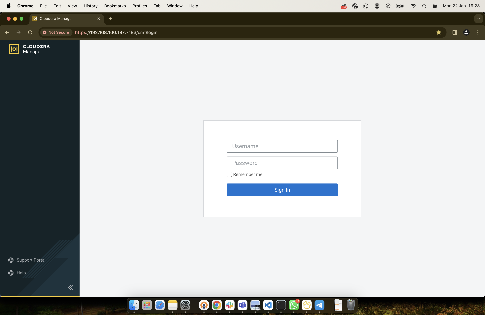

# Accessing the Cloudera Manager Admin Console

```
How to open and log in to the Cloudera Manager Admin Console.
```
```
About this task
To access the Cloudera Manager Admin Console:
```
```
Procedure
```
1. Open the Cloudera Management Console in a Web browser using the following URL:

```
192.168.106.197:7183
```
2. Enter your user name.
3. Enter your password.
4. Click the Sign In button.

```
Results
The Cloudera Manager Admin Console opens.
```
